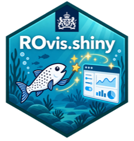

<!-- badges: start -->
[](https://github.com/rivm-syso/ROvis.shiny/actions/workflows/ci.yaml)
[](https://github.com/rivm-syso/ROvis.shiny/actions/workflows/ci.yaml)
[](https://github.com/rivm-syso/ROvis.shiny/actions/workflows/ci.yaml)
<!-- badges: end -->

# ROvis.shiny <a href="https://github.com/rivm-syso/ROvis.shiny"></a>

## Rijksoverheid Visualisatie - shiny

## Description
A tool to support the visualisation of graphs of echarts4r, plotly, ggplot2, highcharter, leaflet, etc. by providing standardized Rijksoverheid (Dutch National Government) styling. This package is part of the [ROvis umbrella package] (https://github.com/rivm-syso/ROvis).

## Installation

```r
# Install from GitHub (private repo - requires GitHub auth, e.g. a PAT
# via usethis::create_github_token() / gitcreds, since this repo is private)
# install.packages("remotes")
remotes::install_github("rivm-syso/ROvis.shiny")
```


## Usage
A short example of on how to use the ro_shiny_graph_panel_ui() and ro_shiny_graph_panel_server functions in combination with your plotly-object.
For the full functionality, please see the vignettes.

```r
# Make a function for the plotly plot
plotly_function <- function(example_data) {
  plotly::plot_ly(
    data = example_data,
    x = ~`Aantal cases`,
    y = ~`Leeftijdsgroep`,
    color = ~Geslacht,
    type = "bar",
    orientation = "h"
  )
}

# Make the ui and server of the app
ui <- shiny::fluidPage(
  useShinyjs(),
  ro_shiny_graph_panel_ui("mod1", plotly::plotlyOutput)
)

server <- function(input, output, session) {
  ro_shiny_graph_panel_server(
    id = "mod1",
    plot_render_fun = plotly::renderPlotly,
    plot_data_fun = function() plotly_function(example_data),
    data = example_data,
    caption = "Aantal gevallen per leeftijdsgroep en geslacht"
  )
}

shiny::shinyApp(ui = ui, server = server)
```

## Support
First point of contact for questions: spin@rivm.nl (spin@rivm.nl)

## Contributing
We welcome contributions and are always happy to see people help improve this package.
If you would like to contribute, please first open an issue to describe the bug, feature, or proposed change. Once you are ready, submit a pull request linked to that issue.
All contributions will be reviewed by the SPIN team before they are merged.

## Instructions for developers 

Below we describe the most important guidelines and practicalities for R package
development on this project.


### Requirements
We use the `testthat`, `lintr` and `roxygen2` package for development of tests, code style 
checks and automatic documentation. We also use the `devtools` and `usethis` package during 
development to adhere to standards for R packages and make developing easier! Install them 
in your Rstudio environment:

```r
install.packages(testthat)
install.packages(lintr)
install.packages(roxygen2)
install.packages(quarto)
install.packages(pkgdown)
install.packages(devtools)
install.packages(usethis)
```

### Guidelines
Type `devtools::load_all()` in your console each time you start developing. This loads 
all dependencies and non-exported functions in the NAMESPACE. This makes developing a lot easier!

To ensure code standardization and quality, follow these guidelines:
- Add tests with `usethis::use_test()`
- Add a new package dependency to the DESCRIPTION file with `usethis::use_package()`. We use 
the `min_version` argument to specify a minimum version. 
- Add a new function dependency to the NAMESPACE with `usethis::use_import_from()`
- Add documentation to new functions by inserting a roxygen skeleton and use `devtools::document()` to
create automatic documentation in the `man` folder

## Authors and acknowledgment
This R packages was created by ROvis team (spin@rivm.nl).

## License
The code can be re-used under license [EUPL v.1.2](https://eupl.eu/1.2/en/). See [LICENCE](LICENCE) for details.
