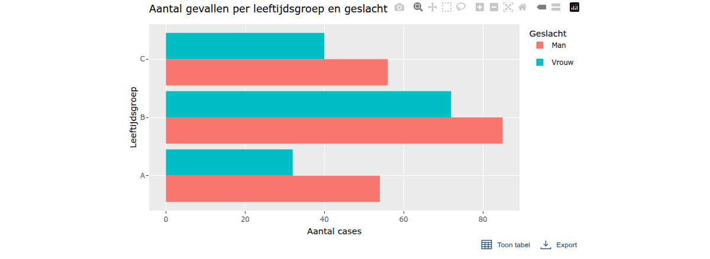
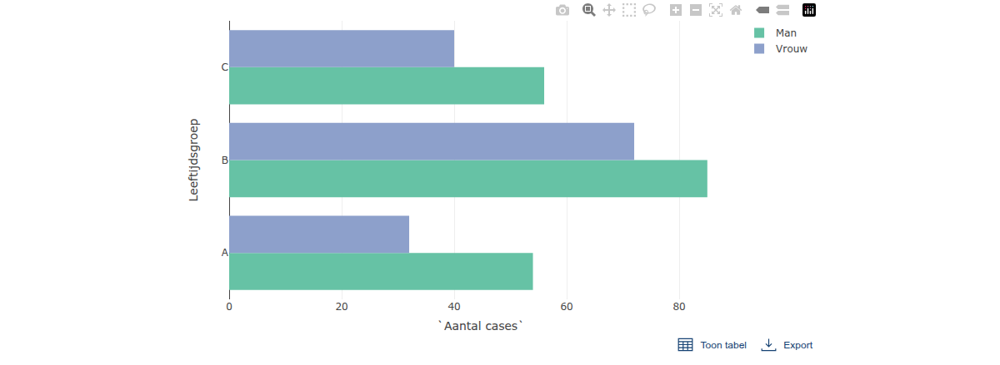
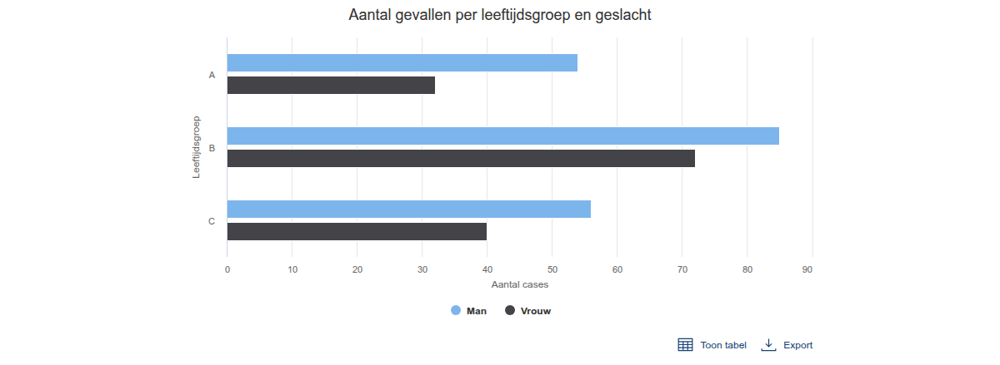
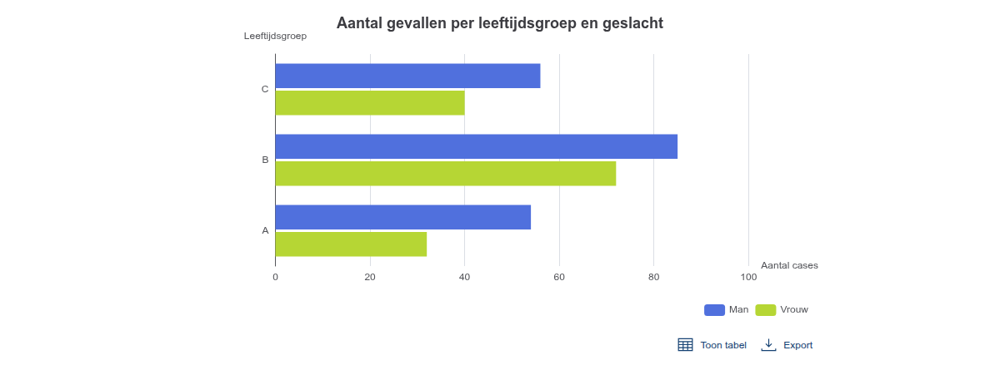

```{r eval, include = FALSE}
knitr::opts_chunk$set(collapse = TRUE, echo = TRUE)
```

# Introduction
It is neccesary for interactive plots to have a table and a skip-link to meet the accessibility requirements. This vignette demonstrates the usage and accessibility features of the `ro_shiny_graph_panel_ui` and `ro_shiny_graph_panel_server` modules for creating accessible data visualizations in shiny-apps

Key Accessibility Features: 

- Skip-link: Provides keyboard users and screen readers a way to skip directly to the data table, bypassing the interactive plot.
- Data table: All plotted data is also available in a structured, accessible, downloadable table, meeting accessibility requirements for interactive visualizations.

These features help ensure your interactive visualizations are accessible for everyone, including users relying on screen readers or keyboard navigation.

Note: The example plots in this vignette are for demonstration only and do not themselves comply with the RIVM huisstijl or accessibility requirements.

## How does it work?
The main module is composed of:

- An interactive plot (using any charting package: Plotly, ggplotly, highcharter, echarts4r, etc.).
- A visible skip-link at the top, which is accessible for screen readers and keyboard navigation.
- A table toggle button, allowing users to show or hide the accompanying data table.
- A download button for exporting the data table.
- A data table, rendered with accessibility and keyboard navigation in mind.

This module is integrated into any Shiny app, and supports different plotting libraries by passing the appropriate UI and render functions.

Note: On the shiny-ui level, `shinyjs::useShinyjs()` needs to be used.

# Usage Examples
Below are examples of using the accessibility module with different chart types.

In each case, the accessibility features (skip-link and data table) are provided by the module, while the plot itself is only for illustrative purposes.

Note: The apps in the vignette are simply static .png files, which is not really showing the skip-link and table functionality well.
If you would like to see the interactive plots and apps in function, then run the example code

## Example data
```{r setup, include = TRUE}
library(ROvis.shiny) # nolint: missing_package_linter.
library(shinyjs) # nolint: missing_package_linter.

example_data <- tibble::tibble(
  `Leeftijdsgroep` = rep(c("A", "B", "C"), each = 2),
  Geslacht = rep(c("Man", "Vrouw"), 3),
  `Aantal cases` = sample(10:100, 6)
)
```

## ggplotly example
This example uses a ggplot2 bar chart, made interactive with plotly. The accessibility module wraps the plot and ensures the data table and skip-link are present.
`plotlyOutput`	and `renderPlotly` are used in the `ro_shiny_graph_panel_ui` and `ro_shiny_graph_panel_server` modules below. 
```{r ggplotly, include = TRUE}

# Install dependencies if not installed yet
if (!requireNamespace("ggplot2")) {
  install.packages("ggplot2", dependencies = TRUE)
}
if (!requireNamespace("plotly")) {
  install.packages("plotly", dependencies = TRUE)
}

# Make a ggplot object
g <- ggplot2::ggplot(example_data,  
  ggplot2::aes(x = `Aantal cases`, y = Leeftijdsgroep, fill = Geslacht)
) +
  ggplot2::geom_col(position = "dodge") +
  ggplot2::labs(
    title = "Aantal gevallen per leeftijdsgroep en geslacht",
    x = "Aantal cases",
    y = "Leeftijdsgroep",
    fill = "Geslacht"
  ) 

# Make the ui and server of the app
ui <- shiny::fluidPage(
  useShinyjs(),
  ro_shiny_graph_panel_ui("mod1", plotly::plotlyOutput)
)

server <- function(input, output, session) {
  ro_shiny_graph_panel_server(
    id = "mod1",
    plot_render_fun = plotly::renderPlotly,
    plot_data_fun = function() plotly::ggplotly(g),
    data = example_data,
    caption = "Aantal gevallen per leeftijdsgroep en geslacht"
  )
}

```
```{r ggplotly_app, eval=FALSE}
shiny::shinyApp(ui = ui, server = server)
```

```{r save_ggplotly, include = FALSE}
app <- shiny::shinyApp(ui = ui, server = server)
webshot2::appshot(app, file = "ggplotly_app.png", vwidth = 1200, vheight = 800, delay = 20)
```

```{r shiny_screenshot_ggplotly, echo=FALSE, out.width="100%", fig.align="center"}

```

## plotly example
Here, we use a basic plotly bar chart. Again, the accessibility module ensures the accompanying data table and skip-link are present.
`plotlyOutput`	and `renderPlotly` are used in the `ro_shiny_graph_panel_ui` and `ro_shiny_graph_panel_server` modules below. 
```{r plotly, include = TRUE}
# Install dependencies if not installed yet
if (!requireNamespace("plotly")) {
  install.packages("plotly", dependencies = TRUE)
}

# Make a function for the plotly plot
plotly_function <- function(example_data) {
  plotly::plot_ly(
    data = example_data,
    x = ~`Aantal cases`,
    y = ~`Leeftijdsgroep`,
    color = ~Geslacht,
    type = "bar",
    orientation = "h"
  )
}

# Make the ui and server of the app
ui <- shiny::fluidPage(
  useShinyjs(),
  ro_shiny_graph_panel_ui("mod1", plotly::plotlyOutput)
)

server <- function(input, output, session) {
  ro_shiny_graph_panel_server(
    id = "mod1",
    plot_render_fun = plotly::renderPlotly,
    plot_data_fun = function() plotly_function(example_data),
    data = example_data,
    caption = "Aantal gevallen per leeftijdsgroep en geslacht"
  )
}


```
```{r plotly_app, eval=FALSE}
shiny::shinyApp(ui = ui, server = server)
```

```{r save_plotly, include = FALSE}
app <- shiny::shinyApp(ui = ui, server = server)
webshot2::appshot(app, file = "plotly_app.png", vwidth = 1200, vheight = 800, delay = 20)
```

```{r shiny_screenshot_plotly, echo=FALSE, out.width="100%", fig.align="center"}

```

## Highcharter example
This example shows how the accessibility module can be used with a highcharter plot. The accessibility features remain the same.
`highchartOutput`	and `renderHighchart` are used in the `ro_shiny_graph_panel_ui` and `ro_shiny_graph_panel_server` modules below. 

```{r highcharter, include = TRUE}

# Install dependencies if not installed yet
if (!requireNamespace("highcharter")) {
  install.packages("highcharter", dependencies = TRUE)
}
if (!requireNamespace("tidyr")) {
  install.packages("tidyr", dependencies = TRUE)
}

# Make a function for the highcharter plot
highcharter_function <- function(example_data) {
  data_hc <- example_data |>
    tidyr::pivot_wider(
      names_from = Geslacht,
      values_from = `Aantal cases`
    )

  highcharter::highchart() |>
    highcharter::hc_chart(type = "bar") |>
    highcharter::hc_title(text = "Aantal gevallen per leeftijdsgroep en geslacht") |>
    highcharter::hc_xAxis(categories = data_hc$Leeftijdsgroep, title = list(text = "Leeftijdsgroep")) |>
    highcharter::hc_yAxis(title = list(text = "Aantal cases")) |>
    highcharter::hc_add_series(
      name = "Man",
      data = data_hc$Man
    ) |>
    highcharter::hc_add_series(
      name = "Vrouw",
      data = data_hc$Vrouw
    ) |>
    highcharter::hc_legend(enabled = TRUE)
}

# Make the ui and server of the app
ui <- shiny::fluidPage(
  useShinyjs(),
  ro_shiny_graph_panel_ui("mod1", highcharter::highchartOutput)
)

server <- function(input, output, session) {
  ro_shiny_graph_panel_server(
    id = "mod1",
    plot_render_fun = highcharter::renderHighchart,
    plot_data_fun = function() highcharter_function(example_data),
    data = example_data,
    caption = "Aantal gevallen per leeftijdsgroep en geslacht"
  )
}
```
```{r hc_app, eval=FALSE}
shiny::shinyApp(ui = ui, server = server)
```

```{r save_hc, include = FALSE}
app <- shiny::shinyApp(ui = ui, server = server)
webshot2::appshot(app, file = "hc_app.png", vwidth = 1200, vheight = 800, delay = 20)
```

```{r shiny_screenshot_hc, echo=FALSE, out.width="100%", fig.align="center"}

```

## Echarts4r example
This example shows how the accessibility module can be used with a echarts plot. The accessibility features remain the same.
`echarts4rOutput`	and `renderEcharts4r` are used in the `ro_shiny_graph_panel_ui` and `ro_shiny_graph_panel_server` modules below. 
```{r echarts, include = TRUE}

# Install dependencies if not installed yet
if (!requireNamespace("echarts4r")) {
  install.packages("echarts4r", dependencies = TRUE)
}
if (!requireNamespace("tidyr")) {
  install.packages("echarts4r", dependencies = TRUE)
}
if (!requireNamespace("tidyr")) {
  install.packages("dplyr", dependencies = TRUE)
}

# Make a function for the echarts plot
echarts4r_function <- function(example_data) {
  example_data |>
    dplyr::group_by(Leeftijdsgroep, Geslacht) |>
    dplyr::summarise(Aantal = sum(`Aantal cases`), .groups = "drop") |>
    tidyr::pivot_wider(names_from = Geslacht, values_from = Aantal) |>
    echarts4r::e_charts(Leeftijdsgroep) |>
    echarts4r::e_bar(Man, name = "Man") |>
    echarts4r::e_bar(Vrouw, name = "Vrouw") |>
    echarts4r::e_title("Aantal gevallen per leeftijdsgroep en geslacht") |>
    echarts4r::e_tooltip(trigger = "axis") |>
    echarts4r::e_legend(right = 10) |>
    echarts4r::e_y_axis(name = "Aantal cases") |>
    echarts4r::e_x_axis(name = "Leeftijdsgroep") |>
    echarts4r::e_flip_coords() 
}

# Make the ui and server of the app
ui <- shiny::fluidPage(
  useShinyjs(),
  ro_shiny_graph_panel_ui("mod1", echarts4r::echarts4rOutput)
)

server <- function(input, output, session) {
  ro_shiny_graph_panel_server(
    id = "mod1",
    plot_render_fun = echarts4r::renderEcharts4r,
    plot_data_fun = function() echarts4r_function(example_data),
    data = example_data,
    caption = "Aantal gevallen per leeftijdsgroep en geslacht"
  )
}

```
```{r echarts_app, eval=FALSE}
shiny::shinyApp(ui = ui, server = server)
```

```{r save_echarts, include = FALSE}
app <- shiny::shinyApp(ui = ui, server = server)
webshot2::appshot(app, file = "echarts_app.png", vwidth = 1200, vheight = 800, delay = 20)
```

```{r shiny_screenshot_echarts, echo=FALSE, out.width="100%", fig.align="center"}

```
